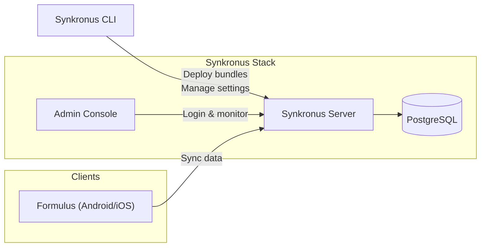

# Quick Start

Set up Open Data Ensemble (ODE) the same way the Community Health Toolkit organizes its “Getting Started” material: short sections, checklists, and a single diagram to anchor the work.

## What You Will Do

1. Confirm the [prerequisites](/docs/quick-start/prerequisites) hardware, software, and skills.
2. Follow [setup environment](/docs/quick-start/setup-environment) to install Git, Docker, Node.js, and the Synkronus CLI.
3. [Deploy a local instance](/docs/quick-start/deploy-local-instance) of Synkronus with Docker Compose.
4. [Upload test data](/docs/quick-start/upload-test-data) so you have something to explore.
5. Install the [Formulus app](/docs/quick-start/formulus-app) and point it at your local server.
6. Review [Making it yours](/docs/quick-start/custom-app) to plan your first customizations.

> [!TIP]
> Complete the pages in order—each one assumes the previous step is done, mirroring the flow in cht-docs.

## System Overview

This simple diagram matches the one in our internal docs: Synkronus CLI and Admin Console push configuration to the server, Formulus syncs data, and PostgreSQL stores it.

## Quick Checklist

- [ ] Laptop running Linux, macOS, or Windows with WSL2
- [ ] Docker Desktop / Docker Engine installed and running
- [ ] Node.js 18+ and Git installed
- [ ] Synkronus CLI downloaded (Linux, macOS, or Windows)
- [ ] Android Studio, plus Xcode if you plan to test iOS

## Output of This Guide

When you finish you will have:

- A Synkronus stack running locally with healthy services
- Admin credentials verified through the Synkronus web UI
- Sample data loaded for smoke tests and demos
- Formulus running on an emulator or device against your stack
- A short list of follow-up tasks for your own deployment

## Next Steps

- Build forms with [JSON Schema + JSON Forms](/docs/build/forms/overview)
- Explore the [Synkronus API](/api) for integrations
- Continue with the [tutorials library](/docs/tutorials) for production deployments
- If you get stuck, check the [FAQ](/docs/quick-start/faq) or ask on the [ODE community forum](https://forum.opendataensemble.org)
